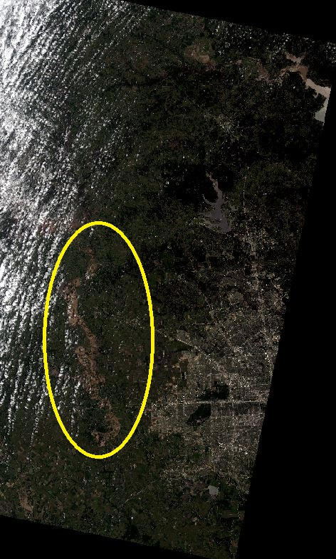
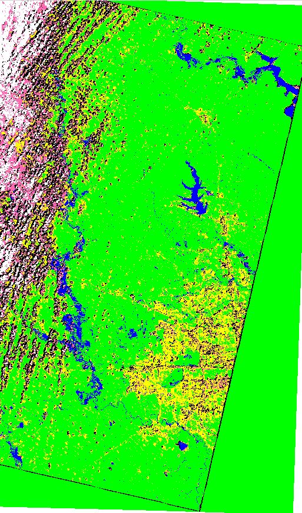
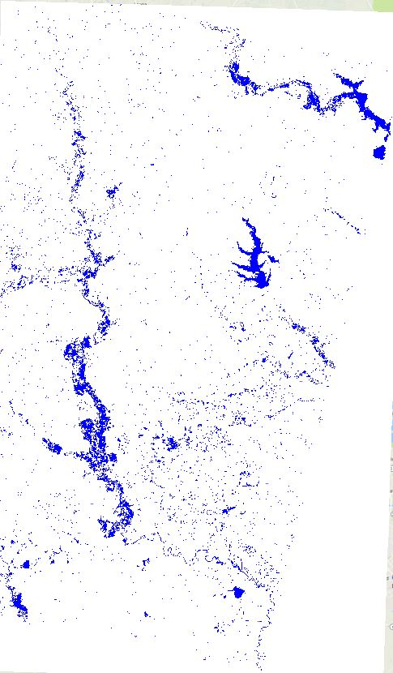
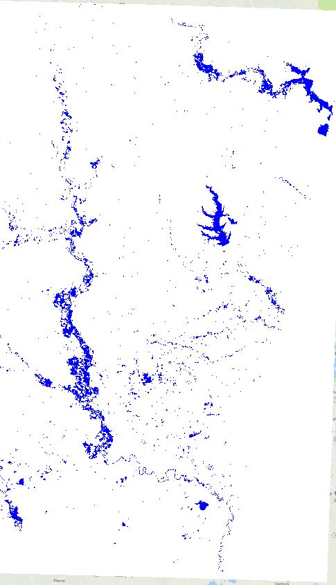

# SatelliteImageClassification
Pixel based classification of satellite imagery
- sample training and testing points generated using Point Sampling plugin in QGIS
- feature generation using Orfeo Toolbox
- feature selection using Learning Vector Quantization
- CLassification using Decision Tree, Neural Networks, Random Forests, KNN and Naive Bayes Classifier
- Ensemble classifier for Flood Inundation Mapping - classifies a pixel as water if 2 or more than 2 of the above classifiers classify a pixel as water
- Mode filter used to remove individually wrongly classified pixels
- Classification accuracy to measure goodness of each model

Outcomes of the best classifier (Multi Layer Perceptron) are as shown below:

To compile and run SatelliteClassification.java, you need weka.jar that you can download from the Weka website.

```
Compile code:  javac -cp weka.jar SatelliteClassification.java  
Run code: java -cp weka.jar:. SatelliteClassification  "trainingFile" "testingFile" "classifiername"
```

- order: 

|clouds: white | 
|roads: yellow |
|shadow: black |
|urban: pink |
|vegetation: green |
|water: blue |

<table width=100%>
<tr>
<th>
Original LANDSAT 8 Image during Flooding
</th>
<th>
Multi Layer Perceptron Classification
</th>
</tr>
<tr>
<th>

</th>
<th>

</th>
</tr>
<th>
Ensemble Classifier: Water vs Everything, without filtering 
</th>
<th>
 Ensemble Classifier: Water vs Everything, after mode filtering 
</th>
</tr>
<tr>
<th>

</th>
<th>

</th>
</tr>
</table>


References:
- LANDSAT-8 imagery(http://earthexplorer.usgs.gov/)
- Image Preprocessing - QGIS (http://www.qgis.org/en/site/), ArcGIS (https://www.arcgis.com/features/index.html)
- Feature selection performed using Orfeo Toolbox (https://www.orfeo-toolbox.org/)
- Feature Selection: Vatsavai, Ranga Raju. "High-resolution urban image classification using extended features." In 2011 IEEE 11th International Conference on Data Mining Workshops, pp. 869-876. IEEE, 2011. 
